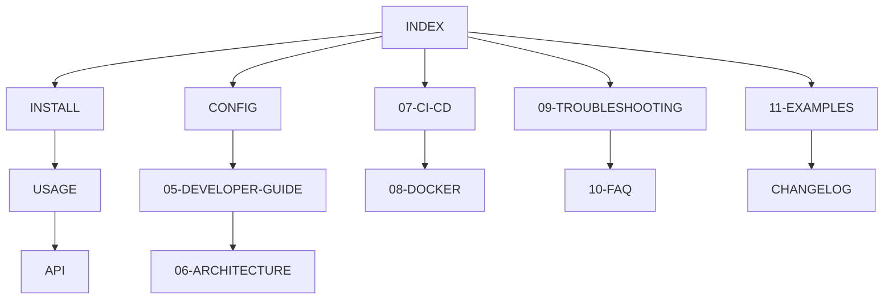

# 📚 Tauri Builder - Dokumentacja

<div align="center">


[](./CHANGELOG.md)
[](../LICENSE)
[](https://www.python.org)
[](https://www.docker.com)

**Zaawansowane narzędzie CLI do budowania aplikacji Tauri dla wszystkich platform**

[Szybki Start](./INSTALL.md) | [Przewodnik](./USAGE.md) | [API](./API.md) | [FAQ](./10-FAQ.md)

</div>

---

## 📖 Spis Treści

### 🚀 Rozpoczęcie Pracy

1. **[Instalacja](./INSTALL.md)**
   - Wymagania systemowe
   - Instalacja krok po kroku
   - Weryfikacja instalacji
   - Szybka konfiguracja

2. **[Przewodnik Użytkowania](./USAGE.md)**
   - Podstawowe komendy
   - Tryby pracy
   - Przykłady użycia
   - Best practices

3. **[Dokumentacja API](./API.md)**
   - Parametry CLI
   - Python API
   - REST API
   - Odpowiedzi i kody błędów

### 🔧 Konfiguracja i Rozwój

4. **[Konfiguracja](./CONFIG.md)**
   - Plik konfiguracyjny YAML
   - Zmienne środowiskowe
   - Dockerfile customization
   - Platform-specific settings

5. **[Przewodnik Developera](./05-DEVELOPER-GUIDE.md)**
   - Struktura projektu
   - Rozszerzanie funkcjonalności
   - Tworzenie pluginów
   - Contributing guidelines

6. **[Architektura](./06-ARCHITECTURE.md)**
   - Diagram architektury
   - Komponenty systemu
   - Flow budowania
   - Decyzje projektowe

### 🔄 Integracje i Deployment

7. **[CI/CD](./07-CI-CD.md)**
   - GitHub Actions
   - GitLab CI
   - Jenkins
   - Azure DevOps

8. **[Docker](./08-DOCKER.md)**
   - Budowanie obrazów
   - Multi-stage builds
   - Optymalizacja
   - Registry management

### 📘 Pomoc i Wsparcie

9. **[Rozwiązywanie Problemów](./09-TROUBLESHOOTING.md)**
   - Częste problemy
   - Kody błędów
   - Debugging
   - Logi i monitoring

10. **[FAQ](./10-FAQ.md)**
    - Najczęściej zadawane pytania
    - Tips & tricks
    - Znane ograniczenia
    - Roadmap

### 📚 Dodatkowe Zasoby

11. **[Przykłady](./11-EXAMPLES.md)**
    - Przykładowe projekty
    - Case studies
    - Recepty
    - Integracje

12. **[Changelog](./CHANGELOG.md)**
    - Historia wersji
    - Breaking changes
    - Migration guides

---

## 🎯 Kluczowe Funkcjonalności

| Funkcja | Opis | Dokumentacja |
|---------|------|--------------|
| 🚀 **Multi-platform** | Buduj dla Windows, macOS, Linux | [Platformy](./USAGE.md#platformy) |
| 🐳 **Docker Integration** | Izolowane środowisko budowania | [Docker](./08-DOCKER.md) |
| 📦 **Auto-packaging** | MSI, DMG, DEB, AppImage | [Pakowanie](./CONFIG.md#bundle-types) |
| 🔄 **Hot Reload** | Development z live reload | [Dev Mode](./USAGE.md#tryb-developerski) |
| 📤 **GitHub Releases** | Automatyczna publikacja | [Publishing](./07-CI-CD.md#github-releases) |
| 🔧 **CI/CD Ready** | Pełna integracja | [CI/CD](./07-CI-CD.md) |
| 🎯 **Cross-compilation** | ARM64 i x64 | [Architektury](./06-ARCHITECTURE.md#cross-compilation) |
| 📝 **YAML Config** | Elastyczna konfiguracja | [Config](./CONFIG.md) |

---

## 💡 Szybki Start

### Minimalna konfiguracja

```bash
# Instalacja
pip install -r requirements.txt

# Pierwsze uruchomienie
./tb.sh setup

# Development
./tb.sh dev

# Build
./tb.sh build --all
```

### Przykład użycia

```python
from tauri_builder import TauriBuilder, BuildConfig

config = BuildConfig(
    dockerfile=Path("Dockerfile"),
    frontend_port=3000,
    mode="build",
    platforms=["windows", "linux"],
    optimize=True
)

builder = TauriBuilder(config)
builder.run()
```

---

## 🗺️ Mapa Dokumentacji



---

## 📊 Status Projektu

| Komponent | Status | Wersja | Testy |
|-----------|--------|--------|-------|
| Core CLI | ✅ Stable | 1.0.0 |  |
| Docker Builder | ✅ Stable | 1.0.0 |  |
| GitHub Publisher | ✅ Stable | 1.0.0 |  |
| Cross-compilation | 🔄 Beta | 0.9.0 |  |
| ARM64 Support | 🔄 Beta | 0.9.0 |  |
| Web UI | 📅 Planned | - | - |

---

## 🤝 Wsparcie

- 📧 **Email**: support@tauridock.com
- 💬 **Discord**: [Join our server](https://discord.gg/tauridock)
- 🐛 **Issues**: [GitHub Issues](https://github.com/digitaltwin-run/tauridock/issues)
- 📖 **Wiki**: [GitHub Wiki](https://github.com/digitaltwin-run/tauridock/wiki)

---

## 📜 Licencja

Ten projekt jest dostępny na licencji MIT. Zobacz [LICENSE](../LICENSE) dla szczegółów.

---

<div align="center">

**[⬆ Powrót do góry](#-tauridock---dokumentacja)**

Stworzone z ❤️ dla społeczności Tauri

</div>